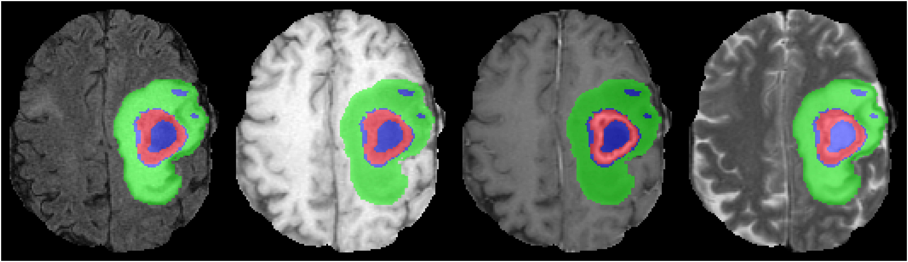

# GliMR MONAI workshop notebooks

This repository is for MONAI notebooks that will be used for the GliMR workshop.

## Notebook contents

The notebooks have been divided into two 1-hour sessions. The first is classification and saliency, and the second is segmentation.

### Classification

The first task is that of classification. Participants are asked to create a training script that will differentiate between scans containing tumorous voxels, and those without (healthy). We then use our trained classification model to explore saliency/interpretability. This is useful for trying to understand *why* networks make the decisions they make.

### Segmentation

The second task is segmentation. We convert our dataset into binary (tumorous voxels or not, as opposed to multiple classes given in the example image below), and then create a network to detect tumorous voxels in our input images.

## Decathlon brain tumour dataset

For this workshop we will be using the [Decathlon dataset](http://medicaldecathlon.com). Specifically, we will be using the Task01_BrainTumour dataset. 

For the sake of quick training, we will focus on 2D slices from this dataset, but the process would be almost identical for the full 3D data. Plenty of examples of 3D classification and segmentation can be found in the [MONAI tutorials repository](https://github.com/Project-MONAI/tutorials).

The data can either be downloaded from Google Drive, or generated on the fly using the provided script `2d_slice_creator.py`. Three folders will be created, each containing a slice of 2D data. The folder `image_tumour` contains a slice of each of the input images cropped to the slice containing the most non-background segmentation voxels. `label_tumour` is the same slice that corresponds to each image in `image_tumour`. An example of these two can be seen below. The last folder is `image_healthy`, which contains a slice of each of the input images, but where there are no tumorous voxels present in the segmentation.

The folders `image_tumour` and `image_healthy` will be used for the classification task, whereas the folders `image_tumour` and `label_tumour` will be used for the segmentation task.

- Target: Gliomas segmentation necrotic/active tumour and oedema
- Modality: Multimodal multisite MRI data (FLAIR, T1w, T1gd, T2w)
- Size: 750 3D volumes (484 Training + 266 Testing)
- Source: BRATS 2016 and 2017 datasets.
- Challenge: Complex and heterogeneously-located targets

  

## Running the notebooks

Aside from gaps left intentionally for user input, notebooks should be able to run as-is. They start by checking that MONAI is installed, and install it if necessary (plus any extra dependencies). The notebooks should be able to run in Google Colab, which allows users to access a GPU free of charge.

To open these notebooks in Google Colab, you can either navigate there and then copy and paste this repository's URL, or you can click the blue "Open in Colab" button that is in the first cell of each notebook.

It should be possible to enable the GPU in Google Colab with: `Runtime > Change runtime type > Hardware accelerator > GPU`.

## User input

Gaps may have been left at certain places in the notebooks, and the user is asked to fill these gaps in. Suggested solutions are hidden in a collapsible text box. Feel free to rely on these as much as necessary, but you will get the most of the experience if you think it through or search the internet prior to displaying the results. Remember there are lots of ways of achieving the same goal, so it's OK if your solutions are different!
